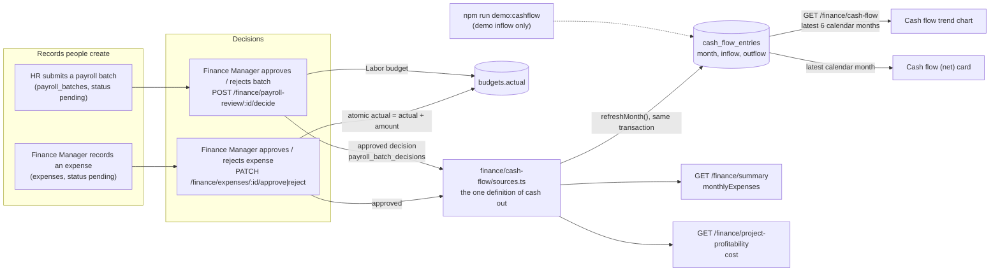

# Cash flow data lineage

Where every figure on the Finance Dashboard's money cards and the "Cash flow trend" chart comes from, and what is real versus demo data. Written from the code on the `staging` branch.

## Lineage

## Who touches what

| Role / event | Effect on cash flow |
|---|---|
| Finance Manager records an expense | Creates a **pending** expense. No cash movement. |
| Finance Manager (or Admin) approves an expense | Expense becomes `approved`; the month's outflow is recomputed; the matching budget line's `actual` grows. |
| Finance Manager rejects an expense | Status only. No budget or cash change. |
| Site Personnel attendance | Feeds HR payroll lines; no direct cash effect. |
| HR submits a payroll batch | Batch is `pending`. No cash movement. |
| Finance Manager approves a payroll batch | The batch's employer cost (gross for legacy batches) counts as outflow in the month of the approving decision, and is booked to the project's Labor budget. |
| Finance Manager rejects a payroll batch | Sent back to HR. No cash movement. |
| Budget Change Request workflow | Moves `budgets.planned` only. **Not cash.** |
| Owner and other dashboards | They do not read `cash_flow_entries`. Only the Finance Dashboard does. |

## Columns of `cash_flow_entries`

| Column | Derived from |
|---|---|
| `month` | Label such as `Jan 2026`, unique per month (migration `0024`). Calendar month in UTC. |
| `outflow` | Recomputed (never incremented) from approved expenses in the month of `expenses.submitted_at`, plus approved payroll batches in the month of the approving `payroll_batch_decisions.decided_at`. |
| `inflow` | **Not derived from any record.** No client-payment record exists. Filled only by the demo script. |

## One definition of cash out

`finance/cash-flow/sources.ts` is the only place that decides what counts as money leaving. It is used by the chart, "Monthly expenses", and project profitability cost, so the three cannot disagree.

## Limitations

- Inflow is demo data (`npm run demo:cashflow`). The system records no client payments or invoices; `projects.contract_value` is the only money-in figure.
- `expenses` has no approved-on column, so an expense counts in the month it was **submitted**, not the month it was approved.
- Cash flow is cash paid, not cost committed (no purchase orders exist).
- An approved expense with no budget line of the same project and category is counted in cash flow but against no budget; the approval response says so.
- There is no bank integration; this is a monthly rollup, not a reconciled bank position.
